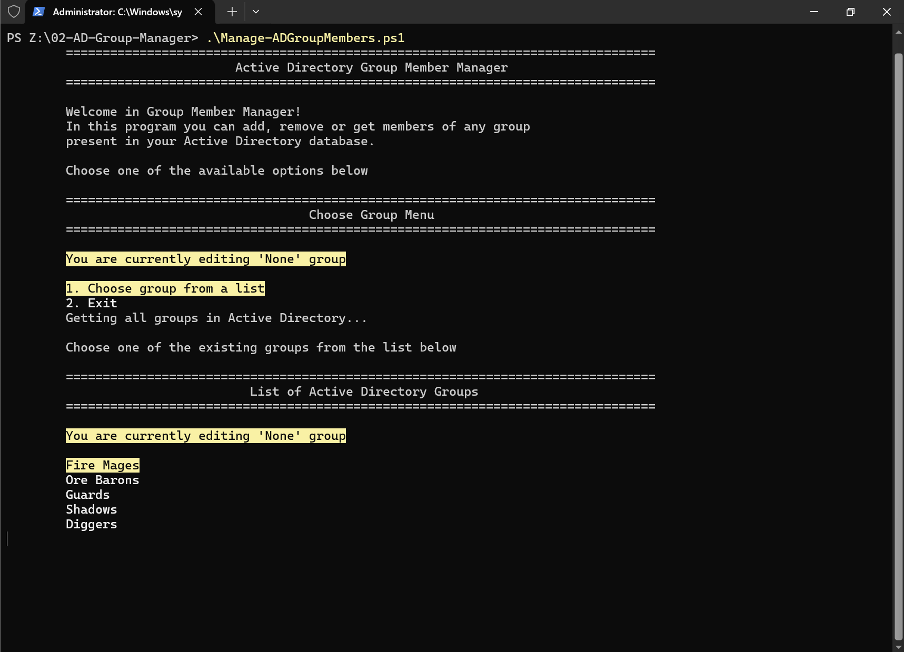
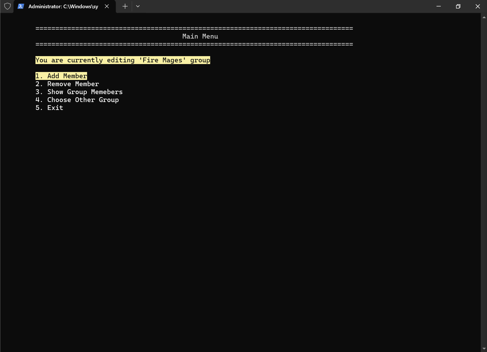
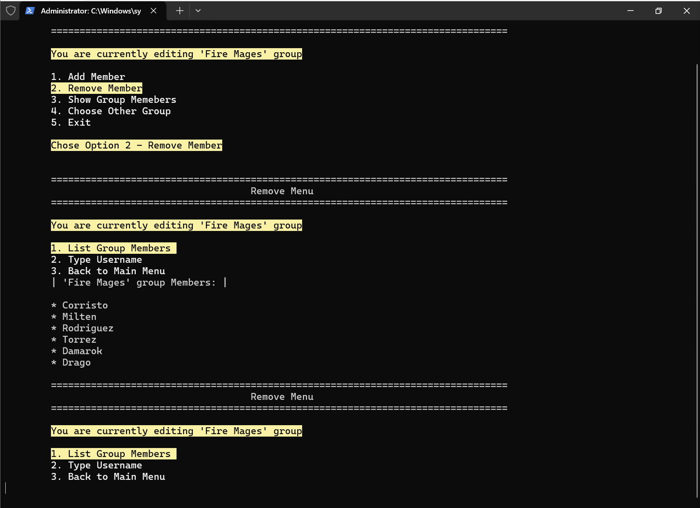
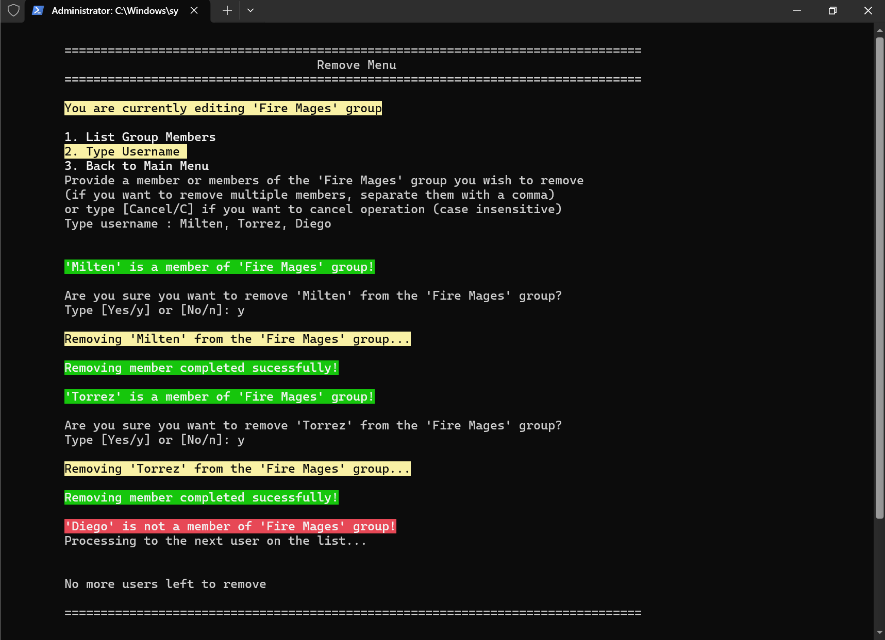

# AD-Group-Manager

A PowerShell script designed to securely automate user provisioning and membership management 
within Active Directory Security Groups.

It is a tool dedicated for administrators who want to speed up their work by delegating 
mundane and repetitive tasks, such as adding or removing multiple users, to an automated script.

Previously, these tasks had to be performed manually, either via the GUI or individual PowerShell cmdlets. 
Now, it is possible to execute them on a massive scale with just a few keystrokes!

## Key Features

* Interactive TUI Menu – Arrow-key navigation for intuitive group and option selection.
* Bulk Operations – Support for adding or removing multiple members simultaneously by providing a comma-separated list.
* Active Directory User Validation – Pre-execution validation using `Get-ADUser` wrapped in try/catch blocks to ensure user existence before group assignment.
* Permission & Error Handling – Prevents script crashes and gracefully handles insufficient AD permissions during modifications (Add/Remove-ADGroupMember) using advanced try/catch mechanisms.

## Prerequisites

Before running the script, ensure your environment meets the following requirements:

* **Operating System:** Windows 10/11 or Windows Server.
* **PowerShell:** PowerShell 5.1 or higher.
* **Active Directory Module:** The `ActiveDirectory` PowerShell module must be installed to execute the required domain cmdlets.
* **Domain Connectivity:** The script must be executed on a Domain Controller or a machine with an active remote connection to an Active Directory domain.

## Installation & Setup

1. Clone or download this repository to your local machine.
2. **IMPORTANT:** The `Show-ArrowMenu.ps1` file must reside in the exact same directory as the main `Manage-ADGroupMembers.ps1` script. 
   *(Note: If you decide to move this file to a different directory, you must manually update its path in the `# IMPORTED FUNCTIONS #` section at the top of the main script).*

## Usage / How to Run

Open your PowerShell terminal, navigate to the script directory, and execute the script. 

You can run it with your custom Active Directory OU path:
```powershell
.\Manage-ADGroupMembers.ps1 -OUPath "OU=User Groups,OU=Groups,OU=Camp,DC=oldcamp,DC=gothic,DC=inc"
```
**Note**: The -OUPath parameter is pre-configured with a default value. If you do not provide this parameter, the script will automatically search for groups within that default path.

## Project Structure

```text
02-AD-Group-Manager/
├── Manage-ADGroupMembers.ps1  # The main script containing the application logic and menus.
├── Show-ArrowMenu.ps1          # Helper function providing the interactive TUI arrow-key navigation.
├── README.md                  # Project documentation and setup guide.
└── demoImages                 # Folder for demo images
    ├── beginning.png
    ├── mainMenu.png
    ├── removeMenu.png
    └── removeProcess.png
```

## Screenshots / Demo

### Start of the program


### Main Menu


### Remove Menu


### Remove Process

